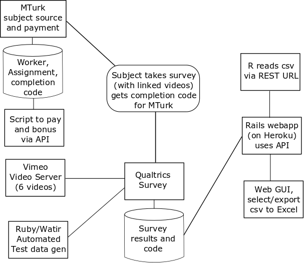

```{r setup, include=FALSE}
knitr::opts_chunk$set(echo = TRUE)
library(stargazer)
library(ggplot2)
library(reshape2)
library(gridExtra)
library(kSamples)
```

#1. Introduction and motivation

Travelers of Interstate Highway 5 (I-5) pass a memorable landmark in California's Central Valley- the Harris Ranch feedlot.  Located near the intersection of I-5 and California Route 198, it is readily visible from I-5 to motorists.  It is also well-known for the pungent smell of thousands of cattle, usually noticable for several miles.  

For city-dwellers and other travelers unfamiliar with feedlots, the sight (and smell) may be shocking.An obvious speculation is that beef consumers may, upon viewing the conditions under which cattle are raised in their final weeks prior to slaughter, exhibit a reduced demand for beef.

#2. Summary findings

We conducted a survey with approximately 400 MTurk subjects. We asked questions related to their level of beef consumption, as well as some demographic information.   We then assigned them two one of three equally-sized groups, and asked them to view one of three one-minute videos:  Control (who were presented with a video showing dams, canals, and agricultural irrigation), "Pastured" (who were presented with a video of cattle grazing in open range conditions), and "Feedlot" (who were presented with a video of cattle confined to a feedlot.)  After viewing the videos, subjects had to answer a question to verify compliance (i.e. that they'd viewed the full one-minute video), then were asked to rank the desirablity of different food types (including a beef item) for their next meal.  They were also asked to predict how many servings of beef they would consume in the coming week (that is, post treatment)

While we anticipated the feedlot video would result in a decrease in demand for beef, we did not find that.  However, we unexpectedly did see a significant effect on demand for beef among subject who viewed the pasture video.  This effect was an increase among male subjects, but no real effect among female subjects.

#3. Methods

##3.1 Design

The objective of our study was to determine if viewing a cattle feedlot video causes reduction of consumer demand for beef. Subjects participating in the study were asked to take a survey (descibed in Section 3.3) that randomly showed one of three videos depicting cattle feedlots (treatment), irrigation systems (control), or cattle grazing in open pasture (placebo).

##3.2 Subjects

Subjects within the United States were recruited via Amazon Mechanical Turk. Overall, the study enrolled 405 subjects;  396 of whom ultimately passed the attention test, proving they had complied with treatment.

Note that we also translated the survey to Spanish and are, at the time of this writing, attempting to collect similar data in Mexico.

##3.3 Survey and Outcome Measures

Study participants were asked to take a survey. A copy is avialable at (**link**). The first part of the survey asks for some background information that we are interested in as co-variates. These include age, gender, geographical area (rural, suburbs, farm, city), and co-habitating pets. We believe that geographical area is an important co-variate to take into consideration because there may be varying levels of beef consumption depending on where the participant is located. For example, someone who lives in a more suburban area where beef may be less expensive might consume more beef at baseline compared to a person living in the city where beef is more expensive. Another possibility is that people who live on farms may have stronger feelings toward treatment of animals and cattle feedlots. Likewise, people who own pets may be more sympathetic to animals and have stronger reactions to animals living in poor conditions like those in the feedlot video.

After demographic data was collected, participants were then asked to estimate about how many times in the last week they ate pork, dairy, eggs, fruit, beef, and vegetables. The purpose of this question is to obtain a baseline consumption level for various food groups. It also serves to identify any potential vegetarians that may be taking part in the study. Participants were then shown one of three videos at random as treatment, control, or placebo. Each video depicted cattle feedlots (treatment), irrigation systems (control), or cattle grazing in open pasture (placebo). After treatment with video, participants were then shown images of various food items (hamburger, chicken, eggs, grain, and fruit/vegetables) and asked to rank them by preference for their next meal. Finally, the last question asks the participants to estimate how many times in the next week they expect to eat pork, dairy, eggs, fruit, beef, and vegetables. 

To ensure compliance to the treatment videos, each video was embedded with numbers that would appear and flash at certain time points during the video. Participants were then asked to enter the numbers that appeared in the video.

The primary outcome of this study is the difference in ranking of hamburger between groups. The secondary outcome is the difference in differences between groups between the number of times the participant plans to eat beef in the next week and the number of times the participant ate beef in the pervious week.


##3.4 Randomization

The division of subjects into the three groups (Control, Pasture, and Feedlot) was done using Qualtrics survey flow mechanism.   There were actually six videos- two for each group.   They differed only in the digits they displayed during the video as part of the compliance test.  We were aware that MTurk workers might possibly share the "display digits" with each other, so we wanted a minimum of two digit patterns for each of the three groups.   Ultimately, we found very low instances of non-compliance/non-attention *XXX*, many of which were fails from results being left blank (not the "wrong" digit pattern).   We do not believe non-compliance was significant for our analysis.

##3.5 Data pipeline



The basic survey mechanism was Qualtrics.  We presented the survey with the "Berkeley" headline removed.

Subject recruitment and payment was handled via Amazon Mechanical Turk.   Due to the large numbers of participants (50 in some of our pilots, 400 in our main survey), we wrote Ruby scripts to access MTurk APIs and automatically approve (and in some cases bonus) subjects.

Qulatrics doesn't directly host videos;  We tried two approaches:  (1) include HTML5 video elements in the qualtrics survey, hosting the video .mp4 files on github.com, and (2) hosting videos on Vimeo.   We used the former approach on pilots, and the latter on production.  The Vimeo method required less bandwidth, but the github method was, unexpectedly, better at auto scaling videos for phones and tablets.

Due to the complexity of the the survey and reporting mechanisms, we implemented a "Robot" to take our Qualtrics survey.  This was implemented using standard webapp QA tools ("Ruby/Watir").  It proved very useful, not only for finding and correcting errors in the survey and qualtrics API; it also enabled us to produce hundreds of responses with known distributions of random treatment effects.   (These were based on our pilot results, but the generated data sets were much larger.)   This lets us do an informal "End to end" review of the power of our entire data pipeline to identify effects.

Finally, we wrote scripts to pre-process the qualtrics output data.   Initially these were command-line scripts which took the qualtrics-exported .csv file.  A desire to have web access, and also not to distribute qualtrics API keys, led us to re-implement this as a ruby-on-rails application, hosted by a commercial IaaS provider (Heroku.)   After using its web interface to distribute .csv files, it was recognized that REST URLs could be used to provide data directly into R's read.csv function, so the rails server was updated to provide that capability as well.

##3.6 Internationalization

The qualtrics survey (and supporting text in Amazon Mechanical Turk) were translated into Spanish.  At the time of this writing, data is being gathered in Mexico with the Spanish language version

#4 Analysis

```{r}
df = read.csv("https://thawing-shore-85209.herokuapp.com/get_csv/MainRunUS")
#rename some columns
column_names = c("mturkcode", "age", "sex", "living_status", "has_dog", "has_cat", "has_bird", "has_fish",
                 "veg_last_week", "fruit_last_week", "dairy_last_week", "eggs_last_week", "beef_last_week",
                 "pork_last_week", "hamburger_rank", "chicken_rank", "eggs_rank", "grain_rank",
                 "fruit_veg_rank", "veg_next_week", "fruit_next_week", "dairy_next_week", "eggs_next_week",
                 "beef_next_week", "pork_next_week", "video_type", "attention_check")
colnames(df) <- column_names

#Remove anyone failing attention check
nrow(df)
df <- df[df$attention_check == "true",]
nrow(df)

df <- droplevels(df)

# Refactor pet variables to 1/0; should change to look for non-blank, as Spanish-lanugage version
# may differ.
#df$has_dog <- df$has_dog == 'Dog'
#df$has_cat <- df$has_cat == 'Cat'
#df$has_bird <- df$has_bird == 'Bird'
#df$has_fish <- df$has_fish == 'Fish'
df$has_dog <- as.integer(df$has_dog != '')
df$has_cat <- as.integer(df$has_cat != '')
df$has_bird <- as.integer(df$has_bird != '')
df$has_fish <- as.integer(df$has_fish != '')


#column for number of pets
df$num_pets <- df$has_dog + df$has_cat + df$has_bird + df$has_fish


# pre_ is weekly consumption before they watch the video
# post_ is weekly plan for next week


head(df)
```

##4.1 Baseline Characteristics

We plot various baseline characteristics that were collected such as age, sex, living status, and pet ownership.

```{r}
p1 <- ggplot(df, aes(age, color = video_type)) + 
      geom_density() + 
      ggtitle("Distribution of Age")
p2 <- ggplot(df, aes(x = sex, fill = video_type)) + 
      geom_bar(stat = "count", position = position_dodge()) +
      ggtitle("Distribution by Sex")
p3 <- ggplot(df, aes(x = living_status, fill = video_type)) + 
      geom_bar(stat = "count", position = position_dodge()) +
      ggtitle("Distribution by Living Status") +
      theme(axis.text.x = element_text(angle = 90, hjust = 1), plot.title = element_text(size = 16)) + 
      scale_x_discrete(labels = c("City", "Farm", "Rural", "Small Town"))

pets <- df[c("has_dog", "has_cat", "has_bird", "has_fish", "video_type")]
pets_melt <- melt(pets)
pets_melt <- pets_melt[pets_melt$value == 1, ]

get_pet <- function(x) {
  if (x == "has_dog") {
    return("Dog")
  } else if (x == "has_cat") {
    return("Cat")
  } else if (x == "has_bird") {
    return("Bird")
  } else if (x == "has_fish") {
    return("Fish")
  }
}

pets_melt$animal <- sapply(pets_melt$variable, get_pet)

p4 <- ggplot(pets_melt, aes(x = animal, fill = video_type)) + 
      geom_bar(stat = "count", position = position_dodge()) +
      ggtitle("Pet Ownership Among Groups")
layout = rbind(c())
grid.arrange(p1, p2, p3, p4, nrow = 2)
```

Examining the plots, there does not appear to be any systematic imbalance between baseline characteristics that would suggest poor randomization. There appears to be more females and fish owners in the pasture group, but it is likely that this observation is due to random variation. To know for sure, we will need to perform some statistical testing.

To test for distribution similarity in age, we cannot use a typical KS test since we have more than two groups. Instead, we perform an Anderson-Darling k-Sample test to assess for similar distributions.

```{r}
age_P <- df$age[df$video_type == "P"]
age_I <- df$age[df$video_type == "I"]
age_F <- df$age[df$video_type == "F"]

ad.test(age_P, age_I, age_F)
```

From the test results, there is no significant evidence that suggests the distribution of age are significantly different between treatment groups. 

Next, we perform a chi-square test to determine co-variate balance for sex.

```{r}
chisq.test(df$sex, df$video_type)
```

From the results, we find no evidence that suggests a significant imbalance in the allocation of Male and Females to treatment groups.

```{r}

summary(df)

# remember, video_type:  "F" => feedlot, "P" => Pasture, "I" => Irrigation
# Create a new column "vegetarian" for those who never eat meat before treatment
#mean(df$pre_beef)
#mean(df$post_beef)
#mean(df$post_beef[df$sex=="Male"])
#mean(df$post_beef[df$sex=="Female"])
#mean(df$post_beef[df$sex=="Female" & df$video_type=="F"])
#mean(df$post_beef[df$sex=="Female" & df$video_type=="P"])
#mean(df$post_beef[df$sex=="Female" & df$video_type=="I"])


# try a simple regression; set male and Irrigation video as reference levels for those factors
df$sex <-relevel(df$sex, ref = "Male")
df$video_type <-relevel(df$video_type, ref = "I")
df$vegetarian <- (df$beef_last_week == 0) & (df$pork_last_week == 0)
model1 = lm( beef_next_week ~ beef_last_week*vegetarian + factor(sex) + factor(video_type) + factor(sex)*factor(video_type), data=df)
#summary(model1)
```

Nicer output courtesy of stargazer

```{r results="asis"}
stargazer(model1, type="latex", header=FALSE, no.space=TRUE)
```
```{r}
# Now try it with standarized beef scores

df$standardized_beef_last_week <- scale(df$beef_last_week)
df$standardized_beef_next_week <- scale(df$beef_next_week)
model2 = lm( standardized_beef_next_week ~ standardized_beef_last_week*vegetarian + factor(sex) + factor(video_type) + factor(sex)*factor(video_type), data=df)


#summary(model2)
```
```{r results="asis"}
stargazer(model2, type="latex", header=FALSE, no.space=TRUE)
```
```{r}
# Now try it with hamburger rank (1 = most desired, 5 = least desired)
# field is q16_1_rank

##df$standardized_pre_beef <- scale(df$pre_beef)
##df$standardized_post_beef <- scale(df$post_beef)
##model3 = lm( q16_1_rank ~ standardized_pre_beef + factor(video_type), data=df)
#summary(model3)
```
```{r results="asis"}
##stargazer(model3, type="latex", header=FALSE, no.space=FALSE)
```

#5. Conclusions and directions for further investigations

#6. Appendix:  Notes on mehods

##6.1 Qualtrics

##6.2 Amazon Mechanical Turk

##6.3 Production of Treatment and Control Videos
  Field trips
  Editing and rendering
  Hosting

##6.4 Support Scripts
  Pulling results from qualtrics
  Paying subjects
  Automated test/validation generation
