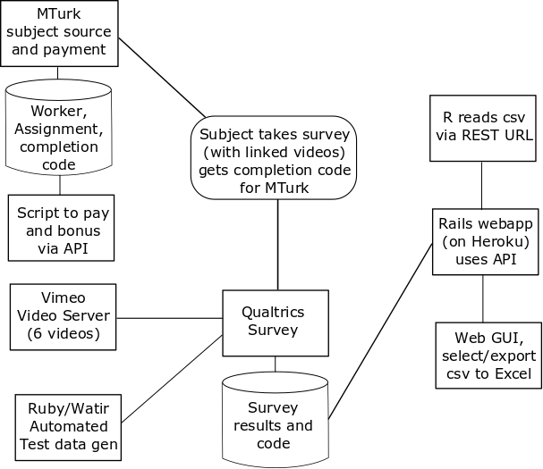

```{r setup, include=FALSE}
knitr::opts_chunk$set(echo = TRUE)
library(stargazer)
library(ggplot2)
library(reshape2)
library(gridExtra)
library(kSamples)
library(MASS)
library(lmtest)
```

#1. Introduction and motivation

Travelers of Interstate Highway 5 (I-5) pass a memorable landmark in California's Central Valley- the Harris Ranch feedlot.  Located near the intersection of I-5 and California Route 198, it is readily visible from I-5 to motorists.  It is also well-known for the pungent smell of thousands of cattle, usually noticeable for several miles.  

For city-dwellers and other travelers unfamiliar with feedlots, the sight (and smell) may be shocking. An obvious speculation is that beef consumers may, upon viewing the conditions under which cattle are raised in their final weeks prior to slaughter, exhibit a reduced demand for beef.

#2. Summary findings

We conducted a survey with approximately 400 MTurk subjects. We asked questions related to their level of beef consumption, as well as some demographic information.   We then randomly assigned them into equally-sized groups, and asked them to view one of three one-minute videos:  Control (who were presented with a video showing dams, canals, and agricultural irrigation), "Pastured" (who were presented with a video of cattle grazing in open range conditions), and "Feedlot" (who were presented with a video of cattle confined to a feedlot.)  After viewing the videos, subjects answered a question about the video to verify compliance (i.e. that they'd viewed the full one-minute video), then were asked to rank the desirablity of different food types (including a beef item) for their next meal.  They were also asked to predict how many servings of beef they would consume in the coming week.

While we anticipated the feedlot video would result in a decrease in demand for beef, we did not find that.  However, we unexpectedly did see a significant effect on demand for beef among subject who viewed the pasture video.  This effect was an increase among male subjects, but no real effect among female subjects.

#3. Methods

##3.1 Design

The objective of our study was to determine if viewing a cattle feedlot video causes reduction of consumer demand for beef. Subjects participating in the study were asked to take a survey (descibed in Section 3.3) that randomly showed one of three videos depicting cattle feedlots (treatment), irrigation systems (control), or cattle grazing in open pasture.  This last video, originally intended as a "lower dose" treatment of cattle images, would ultimately show the greater effect.

##3.2 Subjects

Subjects within the United States were recruited via Amazon Mechanical Turk. Overall, the study enrolled 405 subjects;  396 of whom ultimately passed the attention test, proving they had complied with treatment.

Note that we also translated the survey to Spanish and attempted several pilot tests in Ecuador and Argentina, and attempted a larger study in Mexico.  However, MTurk response was so low (approximatly 12 responses in a week) that the hoped-for Spanish language study was abandoned.

##3.3 Survey and Outcome Measures

Study participants were asked to take a survey (Copy available at https://berkeley.qualtrics.com/jfe/form/SV_dh8NxRde7ld3DtH). The first part of the survey asks for demographic information that we are interested in as covariates. These include age, gender, geographical area (rural, suburbs, farm, city), and co-habiting pets. We initially suspected that geographical area is an important covariate to take into consideration because there may be varying levels of beef consumption depending on where the participant is located. For example, someone who lives in a more suburban area where beef may be less expensive might consume more beef at baseline compared to a person living in the city where beef is more expensive. Another possibility is that people who live on farms may have stronger feelings toward treatment of animals and cattle feedlots. Likewise, people who own pets may be more sympathetic to animals and have stronger reactions to animals living in poor conditions like those in the feedlot video.

Similarly, we included a question about pet ownership.  While possibly having some correlation with economic status, we primarily viewed this as a proxy for general attitude towards anaimals.

After demographic data was collected (but before treatment, participants were then asked to estimate about how many times in the previous week they ate pork, dairy, eggs, fruit, beef, and vegetables. The purpose of this question is to obtain a baseline consumption level for various food groups. It also serves to identify any potential vegetarians that may be taking part in the study.

Participants were then shown one of three videos at random as control and two levels of treatment. The control video featured scenes agricultural irrigation ( https://vimeo.com/263669422/cd376066a1 .)  The "Pasture"  video featured free-range cattle (https://vimeo.com/263669413/c0512edf5f .)  The "Feedlot" Video ( https://vimeo.com/263669431/04c7894ee4 ) featured cattle (in large numbers) confined to feedlots.  To ensure compliance to the treatment videos, each video was embedded with digits that would appear and flash at certain time points during the video. Participants were then asked to enter the digits that appeared in the video.  To ensure that subjects did not share the digits, each of the three videos was actually produced in two editions (with different digits.)  Inspection of the data later indicated no evidence of "digit sharing" between subjects (in the very few cases in which digits were reported incorrectly, they were most commonly blank.)

After viewing the treatment, participants were asked questions about their preference for certain food items.   We asked them to estimate how many times in the coming week they would eat a variety of food items.    Because this question was identical to the pre-test question about previous week food consumptions, we were concerned about the "anchoring" effect the pre-treatment question might have on subjects.  (i.e. the tendency to simply repeat the same answers given on the pre-treatmet questions.)   To combat this, we added, immediately post treatment, an addtional question in a different question format.  We showed subjects images of various food items (hamburger, grilled chicken, eggs, grain, and fruit/vegetables) and asked to rank them by preference for their next meal.   Only after this rank-ordering did the final question ask the participants to estimate how many times in the next week they expect to eat pork, dairy, eggs, fruit, beef, and vegetables. This gives two different fundamental analyses to perform and compare:  First, to regress next week's anticipated beef consumption against last week's (and other co-variates) usintg OLS linear regression.  And second, to use probit ordinal logistic regression to analyze the treatment impact on the ranked desirability of a beef item.


##3.4 Randomization

The division of subjects into the three groups (Control, Pasture, and Feedlot) was done using Qualtrics survey flow mechanism.   There were actually six videos- two for each group (differing only in the verification digits, as noted above.)  Qualtrics survey flow provided the approximately equal random division of subjects between the six videos (and thus the three groups)

##3.5 Data pipeline



The basic survey mechanism was Qualtrics.  We presented the survey with the "Berkeley" headline removed.

Subject recruitment and payment was handled via Amazon Mechanical Turk.   Due to the large numbers of participants (50 in some of our pilots, 400 in our main survey), we wrote Ruby scripts to access MTurk APIs and automatically approve (and in some cases bonus) subjects.

Qulatrics doesn't directly host videos;  We tried two approaches:  (1) include HTML5 video elements in the qualtrics survey, hosting the video .mp4 files on github.com, and (2) hosting videos on Vimeo.   We used the former approach on pilots, and the latter on production.  The Vimeo method required less bandwidth, but the github method was, unexpectedly, better at auto scaling videos for phones and tablets.

Due to the complexity of the the survey and reporting mechanisms, we implemented a "Robot" to take our Qualtrics survey.  This was implemented using standard webapp QA tools ("Ruby/Watir").  It proved very useful, not only for finding and correcting errors in the survey and qualtrics API; it also enabled us to produce hundreds of responses with known distributions of random treatment effects.   (These were based on our pilot results, but the generated data sets were much larger.)   This lets us do an informal "End to end" review of the power of our entire data pipeline to identify effects.

Finally, we wrote scripts to pre-process the qualtrics output data.   Initially these were command-line scripts which took the qualtrics-exported .csv file.  A desire to have web access, and also not to distribute qualtrics API keys, led us to re-implement this as a ruby-on-rails application, hosted by a commercial IaaS provider (Heroku.)   After using its web interface to distribute .csv files, it was recognized that REST URLs could be used to provide data directly into R's read.csv function, so the rails server was updated to provide that capability as well.

##3.6 Internationalization

The qualtrics survey (and supporting text in Amazon Mechanical Turk) were translated into Spanish.  At the time of this writing, data is being gathered in Mexico with the Spanish language version

#4 Analysis

```{r}
df = read.csv("https://thawing-shore-85209.herokuapp.com/get_csv/MainRunUS")
#rename some columns
column_names = c("mturkcode", "age", "sex", "living_status", "has_dog", "has_cat", "has_bird", "has_fish",
                 "veg_last_week", "fruit_last_week", "dairy_last_week", "eggs_last_week", "beef_last_week",
                 "pork_last_week", "hamburger_rank", "chicken_rank", "eggs_rank", "grain_rank",
                 "fruit_veg_rank", "veg_next_week", "fruit_next_week", "dairy_next_week", "eggs_next_week",
                 "beef_next_week", "pork_next_week", "video_type", "attention_check")
colnames(df) <- column_names

#Remove anyone failing attention check
nrow(df)
df <- df[df$attention_check == "true",]
nrow(df)

df <- droplevels(df)


#df$has_dog <- df$has_dog == 'Dog'
#df$has_cat <- df$has_cat == 'Cat'
#df$has_bird <- df$has_bird == 'Bird'
#df$has_fish <- df$has_fish == 'Fish'
df$has_dog <- as.integer(df$has_dog != '')
df$has_cat <- as.integer(df$has_cat != '')
df$has_bird <- as.integer(df$has_bird != '')
df$has_fish <- as.integer(df$has_fish != '')


#column for number of pets
df$num_pets <- df$has_dog + df$has_cat + df$has_bird + df$has_fish


# pre_ is weekly consumption before they watch the video
# post_ is weekly plan for next week


head(df)
```

##4.1 Baseline Characteristics

We plot various baseline characteristics that were collected such as age, sex, living status, and pet ownership.

```{r}
p1 <- ggplot(df, aes(age, color = video_type)) +
      geom_density() +
      ggtitle("Distribution of Age")
p2 <- ggplot(df, aes(x = sex, fill = video_type)) +
      geom_bar(stat = "count", position = position_dodge()) +
      ggtitle("Distribution by Sex")
p3 <- ggplot(df, aes(x = living_status, fill = video_type)) +
      geom_bar(stat = "count", position = position_dodge()) +
      ggtitle("Distribution by Living Status") +
      theme(axis.text.x = element_text(angle = 90, hjust = 1), plot.title = element_text(size = 16)) +
      scale_x_discrete(labels = c("City", "Farm", "Rural", "Small Town"))

pets <- df[c("has_dog", "has_cat", "has_bird", "has_fish", "video_type")]
pets_melt <- melt(pets)
pets_melt <- pets_melt[pets_melt$value == 1, ]

get_pet <- function(x) {
  if (x == "has_dog") {
    return("Dog")
  } else if (x == "has_cat") {
    return("Cat")
  } else if (x == "has_bird") {
    return("Bird")
  } else if (x == "has_fish") {
    return("Fish")
  }
}

pets_melt$animal <- sapply(pets_melt$variable, get_pet)

p4 <- ggplot(pets_melt, aes(x = animal, fill = video_type)) +
      geom_bar(stat = "count", position = position_dodge()) +
      ggtitle("Pet Ownership Among Groups")
layout = rbind(c())
grid.arrange(p1, p2, p3, p4, nrow = 2)
```

Examining the plots, there does not appear to be any systematic imbalance between baseline characteristics that would suggest poor randomization. There appears to be more females and fish owners in the pasture group, but it is likely that this observation is due to random variation. To know for sure, we will need to perform some statistical testing.

To test for distribution similarity in age, we cannot use a typical KS test since we have more than two groups. Instead, we perform an Anderson-Darling k-Sample test to assess for similar distributions.

```{r}
age_P <- df$age[df$video_type == "P"]
age_I <- df$age[df$video_type == "I"]
age_F <- df$age[df$video_type == "F"]

ad.test(age_P, age_I, age_F)
```

From the test results, there is no significant evidence that suggests the distribution of age are significantly different between treatment groups.

Next, we perform a chi-square test to determine co-variate balance for sex.

```{r}
chisq.test(df$sex, df$video_type)
```

From the results, we find no evidence that suggests a significant imbalance in the allocation of Male and Females to treatment groups.

```{r}

summary(df)

# remember, video_type:  "F" => feedlot, "P" => Pasture, "I" => Irrigation
# Create a new column "vegetarian" for those who never eat meat before treatment
#mean(df$pre_beef)
#mean(df$post_beef)
#mean(df$post_beef[df$sex=="Male"])
#mean(df$post_beef[df$sex=="Female"])
#mean(df$post_beef[df$sex=="Female" & df$video_type=="F"])
#mean(df$post_beef[df$sex=="Female" & df$video_type=="P"])
#mean(df$post_beef[df$sex=="Female" & df$video_type=="I"])


# try a simple regression; set male and Irrigation video as reference levels for those factors
df$sex <-relevel(df$sex, ref = "Male")
df$video_type <-relevel(df$video_type, ref = "I")
df$vegetarian <- (df$beef_last_week == 0) & (df$pork_last_week == 0)
model1 = lm( beef_next_week ~ beef_last_week*vegetarian + factor(sex) + factor(video_type) + factor(sex)*factor(video_type), data=df)
#summary(model1)
```

Figure one shows the results of regressing anticipated beef consumption (measured in
servings anticipated next week).  Contrary to our expectation, we
did not find that the feedlot video caused a significant increase in demand for
beef.  Rather, we found that the pasture video caused
an **Increase** in demand for beef, but only among male subjects.

Table two shows the same data, but using standardized scores of beef servings
(helpful for comparision with table 3, the ranking of food items' desirability.)


```{r results="asis"}
stargazer(model1, type="latex", header=FALSE, no.space=TRUE)
```
```{r}
# Now try it with standarized beef scores

df$standardized_beef_last_week <- scale(df$beef_last_week)
df$standardized_beef_next_week <- scale(df$beef_next_week)
model2 = lm( standardized_beef_next_week ~ standardized_beef_last_week*vegetarian + factor(sex) + factor(video_type) + factor(sex)*factor(video_type), data=df)


#summary(model2)
```
```{r results="asis"}
stargazer(model2, type="latex", header=FALSE, no.space=TRUE)
```

Table 3 shows the probit ordinal logistic regression of Beef-item (actually a hamburger) desirability rank regressed on the same predictors as above.  We
see a corroboration of the results.  Pasture video decreases rank [i.e. increases desirablity] for Males viewing the pasture video.   In this regression we did
not, however achieve statistical significance.  An *ad hoc* resampling experiment (e.g. doubling or tripling out data) suggests we'd need about 1,000 subjects - rather
than our 400 - to achieve statistical significance.
```{r}
# Now try it with hamburger rank (1 = most desired, 5 = least desired)
table(df$hamburger_rank)  #Note the sums before factor conversion
df$hamburger_rank_as_factor = factor(df$hamburger_rank, ordered=TRUE)
levels(df$hamburger_rank_as_factor)
levels(df$hamburger_rank_as_factor) = levels=c("Hamburger most preferred", "Hamburger second choice", "Hamburger mid choice", "Hamburger second least preferred", "Hamburger least preferred")
levels(df$hamburger_rank_as_factor)
table(df$hamburger_rank_as_factor) #check the sums after factor conversions
table(df$hamburger_rank_as_factor[df$sex == "Male"])
table(df$hamburger_rank_as_factor[df$sex == "Female"])


levels(df$hamburger_rank_as_factor)
head(df) #just check sanity;  Our first respondent [Male/27] wanted (in order) Eggs, Chicken, Hamburger, Fruit/veg, and Grain
         #second resopndent [Female/27] wanted  (in order) Fruit/Veg., Grain, Hamburger, Eggs, Chicken

#Let's do some more releveling, for consistency with the rest of the paper
df$sex <-relevel(df$sex, ref = "Male")
df$video_type <-relevel(df$video_type, ref = "I")
df$vegetarian <- (df$beef_last_week == 0) & (df$pork_last_week == 0)


#Try with standardized beef (makes more in the case of rank, since we're not comparing actual quantity beef last week/next meal)
df$standardized_beef_last_week <- scale(df$beef_last_week)
mk2 = polr(hamburger_rank_as_factor ~ beef_last_week*vegetarian + sex*video_type, method="logistic", data=df, Hess=TRUE)
coeftest(mk2)
```
```{r results="asis"}
stargazer(mk2, type="latex", header=FALSE, no.space=FALSE)
```

#5. Conclusions and directions for further investigations

Contrary to expectations, the feedlot video didn't have statistically significant effect in reducing demand for beef.   To the contrary, the pasture
video showed an increased demand.  We also saw a curious effect from dog (but not cat) ownership, which might suggest further study.

#6. Appendix:  Notes on mehods

##6.1 Qualtrics

We used qualtrics for presenting our survey (with videos hosted initially on github, ultimamtely on vimeo, as Qualtrics does not
support direct hosting of videos.)  In additon to our survey and treatment items, we used qualtrics to generate a random code for each
subject, which the subject later entered into Amazon Mechanical Turk for completion verification.

One of our team members [AB] translated one of our pilot surveys and our final survey into Spanish.


##6.2 Amazon Mechanical Turk

We used Amazon Mechanical Turk to source (and reward) our subjects.  We did a series of pilots in Canada (to avoid contaminating our
eventual US-pool of workers with our pilot surveys.)

##6.3 Production of Treatment and Control Videos

These videos were shot on three separate feeld trips to California's
central valley or coast (South of Half Moon Bay) on February 17, 24, 
and March 3, 2018.  A Nikon 5300 and several Cannon ELPH-series
cameras were used. 

Sound was was collected onsite during video shoots, with some animal
sounds collected from public domain web sources, such as:

https://home.nps.gov/yell/learn/photosmultimedia/soundlibrary.htm

Some sounds were self-produced by one team member.

Sound was edited and mixed using the Audacity tool.

Videos were stabilized, edited and rendered using the KDENLive tool.

Inkscape was used to draw the flashing digit overlays used to 
assess subject attention to the video.

Video hosting:  After trying to host .mp4 and .webm files on both the vimeo streaming
service and on github, the ultimate decision was to use vimeo for greater
assurance that different browsers could view them.  (Note, however, that
github hosting of the videos gave a better auto-scaling for phones and
tablets.  Our pilots showed us that our mturk workers were all using
laptop/desktop, so that advantage was moot.  This file lists the URLs
of the 6 final videos.   File names are encoded: Initial F for feedlot,
I for irrigation (control), and P for pasture video.   Second and third
letters in the file name encode the "attention-digits" flashed
during the video.

##6.4 Support Scripts

Files:

generate_digits_for_qualtrics_drill_down.rb
  This generates a 1000-line long set of exhaustive combinations of values
for the qualtrics survey drill-down used after each video to ask subjects
to record up to three digits seen during the video.  (For attention
verification)

drill_down.csv
  The file produced by the ruby script above

key.csv
  A sample output file for the "payoff.rb" script, giving more detail
on the meaning of each column of the output.

payoff.rb
  Script to pull the results of a selected survey over from qualtrics,
and do some pre-processing, deleting extraneous columns and calculating
a few columns (e.g. checking for proper response on the attention-digits
drill-down).   It also connects to mturk API to approve HIT assignments
if attention-digits are correct.

response_generator.rb
  A Ruby/Watir web QA script.   This is a robot to run an arbitrary number
of simulated users taking the survey.   It takes about 20 sec. per survey
(but multiple copies may be run in parallel).   Ruby/Watir is built on top
of the Selenium infrastructure and drives chrome/chromium browsers.

robot_small.mp4
  A short demo of a preliminary version of response_generator running
  
##5.5 Web application

We wrote a ruby-on-rails web applcation to serve the results of our various experimental runs.
(https://thawing-shore-85209.herokuapp.com).  This had a simple GUI to permit real-time
access of qualtrics APIs to create and download
data in CSV format.   (Rather than use Qualtircs gui-based csv downloader.)

The rails application permitted helpful pre-processing of the csv file.  It also permitted real
time monitoring of the jobs status without needing to reveal qualtrics API keys.

Finally, a REST/API was added, which permitted us to use read.csv("URL") in our analytic scripts, which
eliminated the need to transfer around .csv data files to team members.  (example: our main run data:
https://thawing-shore-85209.herokuapp.com/get_csv/MainRunUS )

##6.6 Pilots and data runs

###Pilot 1: 10 subjects, two batches of 5
Verified Qualtrics/Mturk, batch "private" visibility, "Canada" qualification

###Pilot 2: 50 subjects, one batch
Video served from github
Tried "Raffle of gift cards" mechanism;  failed (c5 bidders total)
"Robot user" test (on qualtrics; bypassed Mturk)
400 simulated subjects, with simulated treatment effect
Run with ruby/watir web robot software QA tool
Corrected issues with survey, scripts, verified "Power" of tool chain

###Pilot 3: 20 subjects, one batch
Validate final version of survey; video served from Vimeo

###Main Run/US:
Final version of survey; shortened videos to 1 min; new attention test
400 responses in c30 min.;   Review and export results with web tool

###Pilots in Ecuador, Argentina
Both Abandoned
Spanish translation of final version of survey
No responses in either

###Attempted run in Mexico
Few responses (only 11), sme in English, some in Spanish
Unlikely to provide enough data for analysis

